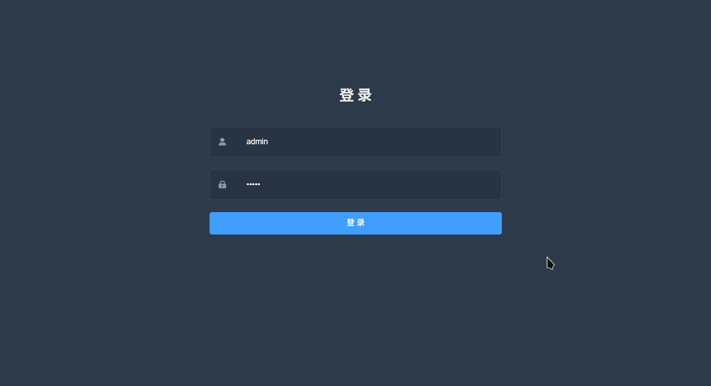

<h1 align="center">Welcome to 车辆管理系统前端 👋</h1>
<p>
  
  <a href="#" target="_blank">
    
  </a>


> 使用Vue.js和ElementUI构建的前端界面。

### 💻 Demo
<div align="center">
    
</div>

### 🎈 Before
> 您需要在本地安装node和git。该项目基于ES2015 +，vue，vue-router，vue-cli，axios和element-ui 我们假设您已经有这些知识。

### 🔑 Install

```sh
//克隆此项目
git clone https://github.com/Ardient/VCMS.git

//进入项目目录
cd vcms

//安装依赖
yarn install

//运行或开发
yarn run serve

//构建
yarn build

```

## Browsers support

Modern browsers and Internet Explorer 10+.

| IE / Edge        | Firefox         | Chrome          | Safari          |
| ---------------- | --------------- | --------------- | --------------- |
| IE10, IE11, Edge | last 2 versions | last 2 versions | last 2 versions |

### 👨 Author

👤 **刘康富**

* Website: www.ardien.xyz
* Github: [@Ardient](https://github.com/Ardient)

## 🧡 Show your support

Give a ⭐️ if this project helped you!

***
